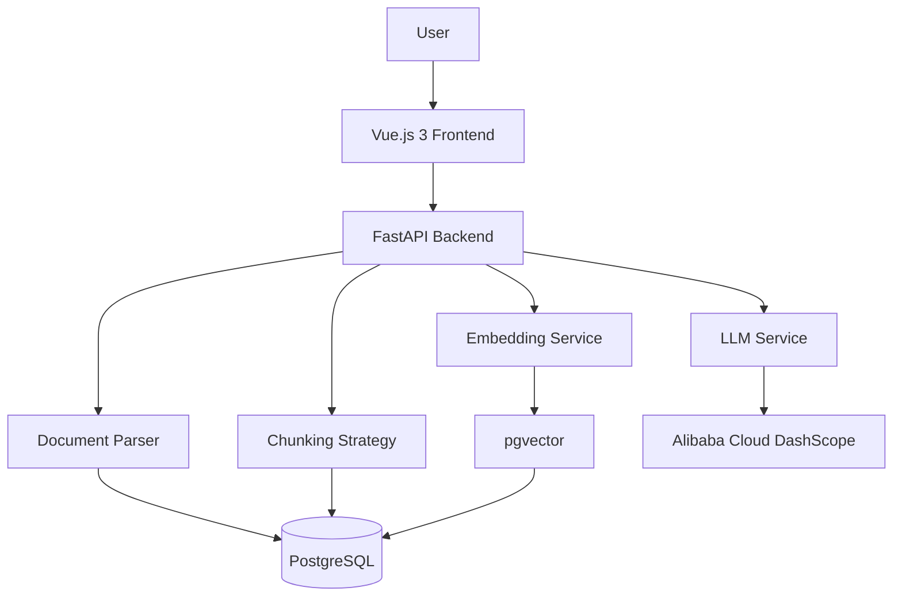

# RAG Demo

An enterprise-grade Retrieval-Augmented Generation (RAG) knowledge base system built with FastAPI, PostgreSQL (pgvector), and Vue.js 3. It supports multi-format document upload, OCR recognition, various chunking strategies, and provides a modern web chat interface with real-time streaming responses.

## 🚀 Quick Start

### Prerequisites
- Python 3.12+
- Node.js 16+
- PostgreSQL 14+ (with pgvector extension)

### Installation & Deployment

#### 1. Database Setup
```bash
# Recommended: Use Docker
docker run -d --name rag-postgres \
  -e POSTGRES_USER=postgres \
  -e POSTGRES_PASSWORD=postgres \
  -e POSTGRES_DB=rag_db \
  -p 5432:5432 \
  pgvector/pgvector:pg16
```

#### 2. Environment Configuration
```bash
cp .env.example .env
# Edit .env and fill in your DashScope API Key and database connection info
```

#### 3. Backend Setup
```bash
uv sync
```

#### 4. Frontend Build
```bash
cd frontend
npm install
npm run build
cd ..
```

#### 5. Start Server
```bash
python -m uvicorn main:app --host 0.0.0.0 --port 8000
```
Visit http://localhost:8000 to access the application.

## 🏗️ Architecture



## ✨ Features

### Document Management
- **Multi-format Support**: PDF, Word, Excel, Images (OCR), Text files.
- **Flexible Chunking**: Recursive, Fixed-size, and Parent-Child strategies.
- **Chunk Preview**: Visualize how documents are split into chunks for better strategy tuning.
- **Collection Management**: Organize documents into different knowledge bases.

### Intelligent Q&A
- **Streaming Responses**: Real-time token-by-token generation.
- **Stop Generation**: Interrupt ongoing stream responses instantly.
- **Source Tracing**: View cited sources with relevance scores and page numbers.
- **Multi-collection Search**: Query across specific or all knowledge bases.

##  Project Structure

```
rag-demo/
├── app/
│   ├── api/                  # API Routes & Schemas
│   ├── core/                 # Core Services (DB, LLM, VectorStore)
│   ├── parsers/              # Document Parsers
│   ├── chunkers/             # Chunking Strategies
│   ├── services/             # Business Logic Orchestration
│   └── static/dist/          # Built Frontend Assets
├── frontend/                 # Vue.js 3 Source Code
├── uploads/                  # Uploaded Documents
├── main.py                   # Application Entry Point
└── README.md                 # This File
```

## ⚙️ Configuration

| Variable | Description | Default |
|----------|-------------|---------|
| `DASHSCOPE_API_KEY` | Alibaba Cloud DashScope API Key | Required |
| `DATABASE_URL` | PostgreSQL Connection String | `postgresql://...` |
| `EMBEDDING_DIM` | Vector Dimension | 1024 |
| `CHUNK_SIZE` | Target Chunk Size | 500 |
| `CHUNK_OVERLAP` | Chunk Overlap | 50 |

## 🛠️ API Reference

### Documents
- `POST /api/documents/upload`: Upload and process a document.
- `GET /api/documents`: List all uploaded documents.
- `GET /api/documents/{doc_id}/chunks`: Preview chunks of a specific document.
- `DELETE /api/documents/{doc_id}`: Delete a document.
- `DELETE /api/documents`: Clear all documents.

### Chat
- `POST /api/chat`: Non-streaming Q&A.
- `POST /api/chat/stream`: Streaming Q&A (SSE).

## ❓ Troubleshooting

### 1. Blank Page
Ensure the frontend is built: `cd frontend && npm run build`.

### 2. Database Connection Error
Check if PostgreSQL is running and the `vector` extension is installed:
```sql
CREATE EXTENSION IF NOT EXISTS vector;
```

### 3. API Key Missing
Verify `DASHSCOPE_API_KEY` is correctly set in `.env`.

##  License

MIT License
